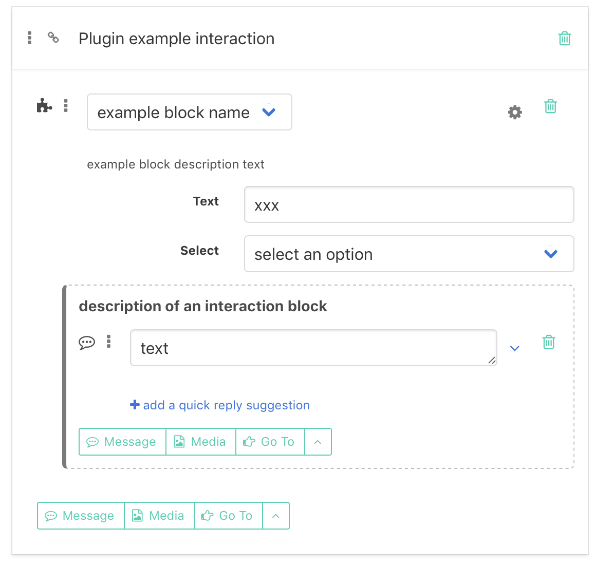

# Plugins

Plugins are **the best way to provide API integrations and business logic** to your chatbot. Plugins is a serverside code with customisable representation in a wingbot.ai designer.

## Plugin representation in designer

Each plugin can be used as any other conversation element like message.



## Configuring the designer

```json
[
  {
    "id": "exampleBlock",
    "name": "example block name",
    "description": "example block description text",
    "inputs": [
      {
        "type": "text",
        "name": "text",
        "label": "Text"
      },
      {
        "type": "select",
        "name": "sel",
        "label": "Select",
        "options": [
          {
            "value": "val",
            "label": "lab"
          }
        ]
      }
    ],
    "items": [
      {
        "id": "responseBlockName",
        "description": "description of an interaction block"
      }
    ]
  }
]
```

You can specify:

- **inputs** - configuration of each plugin

    There are two types: `text`, `select` and `postback`. Input data are accessible in `params` as a 5th parameter of plugin and in `req.params`.

- **items** - the response blocks

    Blocks of conversation elements to respond with. How to **pass the data** to messages? You can use `res.setData({ myVar: 'foo' })` and use the Handlebars template in message like `{{myVar}}`

## Plugin as a function

You can register your plugin simply.

```javascript
const { Plugins } = require('wingbot');

const plugins = new Plugins();

plugins.register('exampleBlock', async (req, res, postBack) => {
    // load the plugin configuration
    const { text, sel } = req.params;

    // set data to make them accessible in handlebars templates
    res.setData({ myVar: text' });

    // run an interaction block
    await res.run('responseBlockName');
});

module.exports = plugins;
```

## Plugin as a nested Router

For more sophisticated use cases you can use the router as a plugin.

```javascript
const { Plugins, Router } = require('wingbot');

const plugins = new Plugins();

const exampleBlock = new Router();

// an incomming route
exampleBlock.use('/', (req, res, postBack) => {
    // load the plugin configuration
    const { text } = req.params;

    // send the text as a response
    res.text(text);

    // make some async job
    postBack('after-timeout', async () => {
        await new Promise(r => setTimeout(r, 1000));
        return { myVar: 'foo' };
    });
});

// following action
exampleBlock.use('after-timeout', async (req, res) => {
    const { myVar } = req.action(true);

    await res.run('responseBlockName');
});

plugins.register('exampleBlock', exampleBlock);

module.exports = plugins;
```

## Testing the plugin

You can use the Tester util.

```javascript
const { Tester } = require('wingbot');
const plugins = require('../../bot/plugins');

describe('exampleBlock plugin', function () {

    it('should work', async function () {
        const t = new Tester(plugins.getPluginFactory('exampleBlock'));

        await t.postBack('/'); // run the initial action

        await new Promise(r => setTimeout(r, 1500));

        // asserts
        t.respondedWithBlock('responseBlockName');
        t.passedAction('after-timeout');
    });

});
```