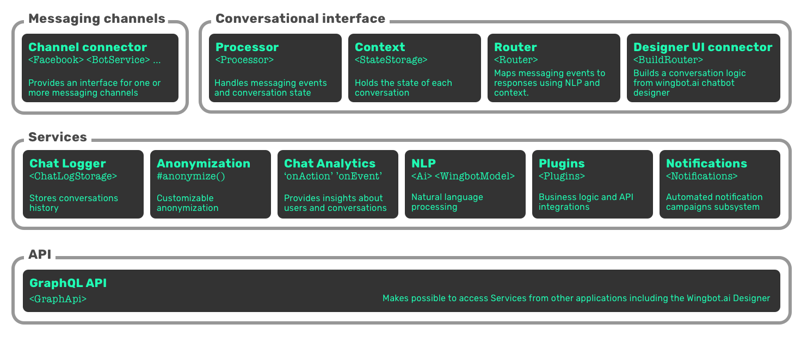

# Architecture and modules

## Messaging channels

Makes bot able to response on any available messaging channel.

- **Connector** (`<Facebook>, <BotService>, ...`) - transforms an incomming event
- **Sender** (`<FacebookSender>, <BotServiceSender>, ...`) - sends an outgoing event

## Conversational interface

Transforms incomming messaging event to bot response and is responsible for managing conversation state.

## Modules (Services)

Provides additional abilities like logging, NLP and Notifications.

- **Chat Logger** - Stores the history of conversations

  Available at `lib/chatLogStorage.js` and connected to Messaging Channel Connector at `bot/index.js`

- **Anonymization** - Filters any sensitive data in text messages

  Available at `bot/anonymize.js`, connected to `<Ai>` at `bot/bot.js` and to Analytics at `bot/onAction.js`

- **Chat Analytics** - By default as an integration to Google Analytics

  Available at `bot/onAction.js` connected to `Processor` at `bot/Processor.js` to catch incomming events and connected to `Router` at `bot/bot.js` to catch all visited interactions.

- **NLP** - Natural language processing service

  Wingbot NLP is built in core `wingbot` NPM module. It's configured in `bot/bot.js` in global `wingbot.ai` service. You can register own NLP modulte with `ai.register(module)` method.

- **Plugins** - Business logic and API integrations

  Available at `bot/plugins/index.js` to be able to register all required modules. Connected at `bot/bot.js` to `BuildRouter`.

- **Notifications**

  Complex subsystem consists of `Notifications` service at `lib/notifications.js` which uses `NotificationsStorage` at the same place. Notifications has own "interval" script in routes and are connected as a processor plugin to `Processor` at `bot/processor.js`.

## GraphQL API

Makes wingbot.ai or other applications able to access bots services. Has own route in `routes/api.js`. Allows to attach or detach any API you want.